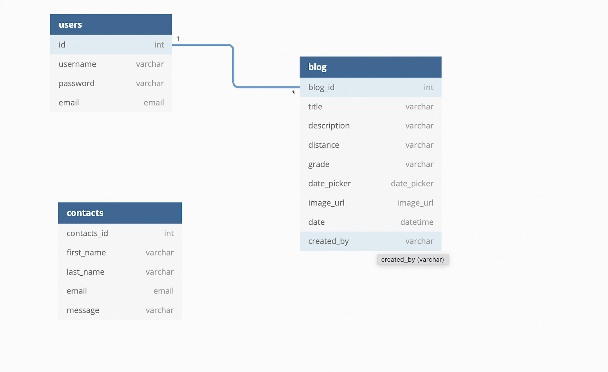
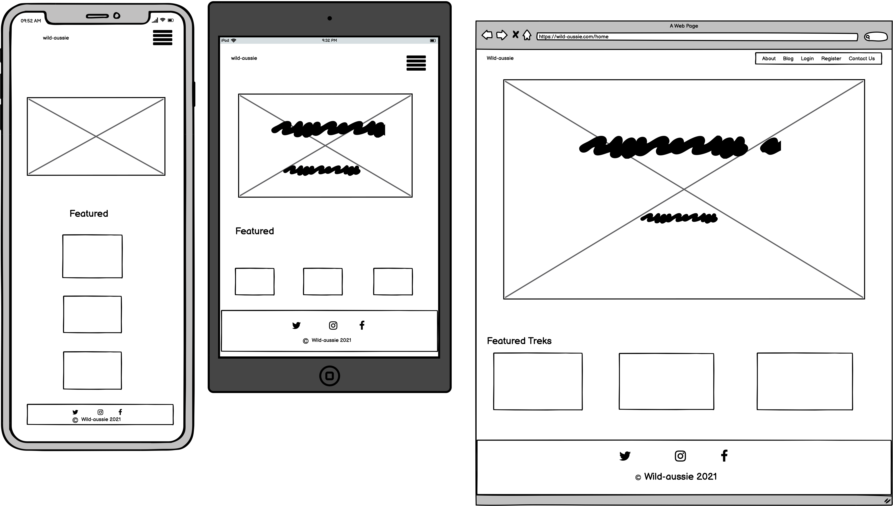
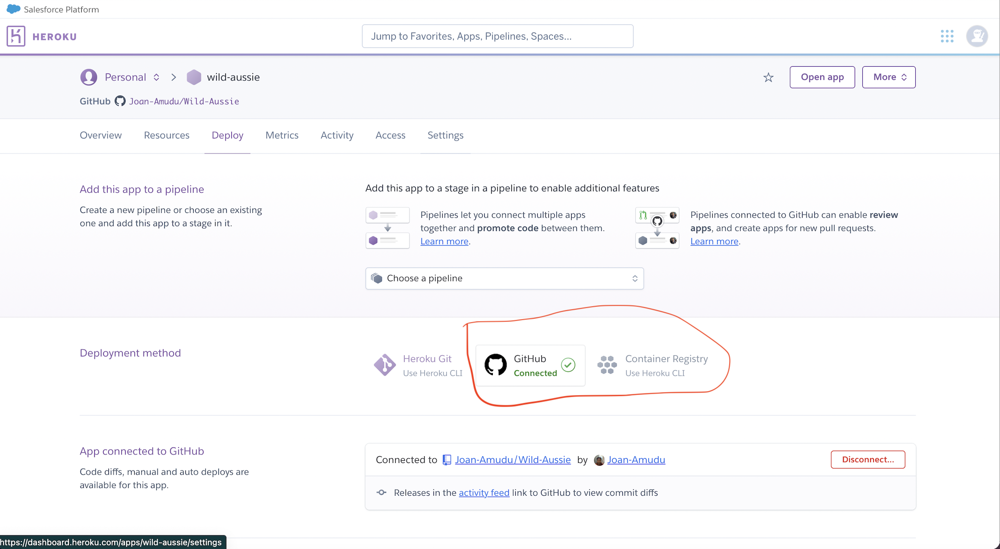
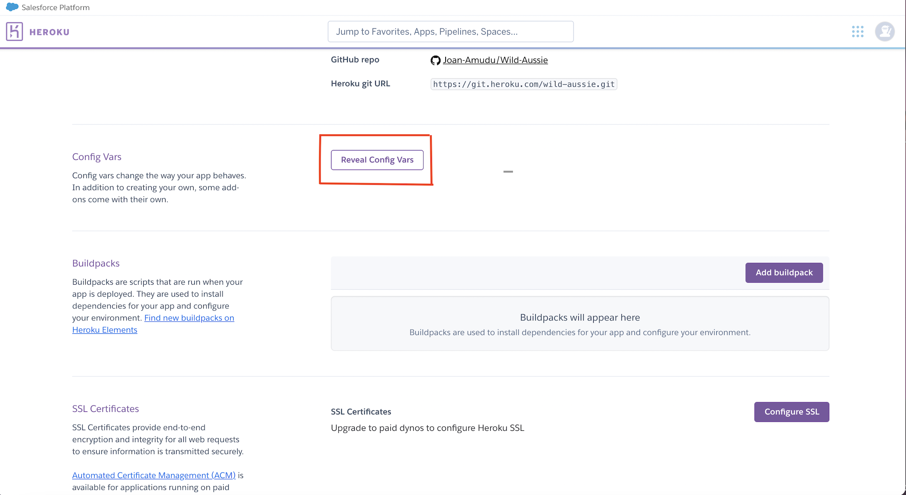
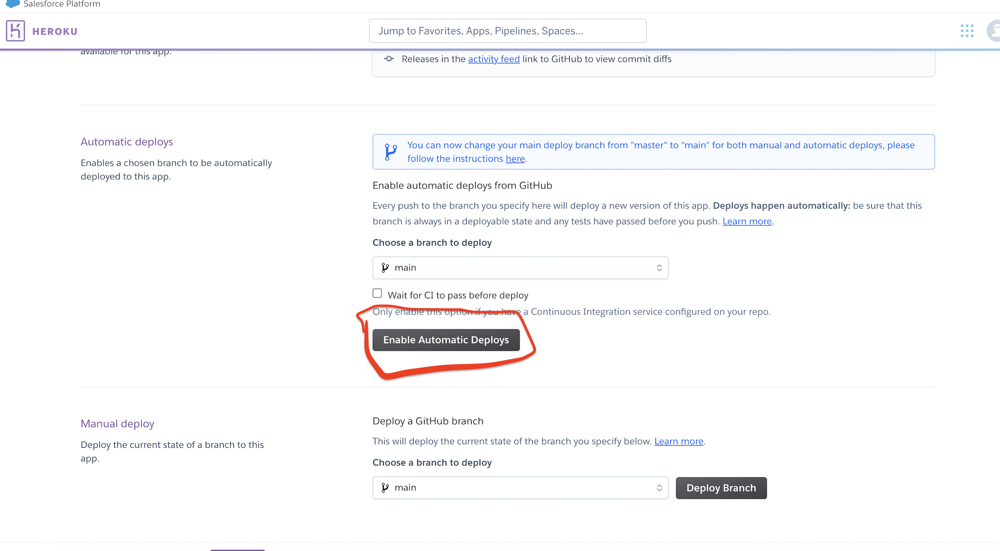
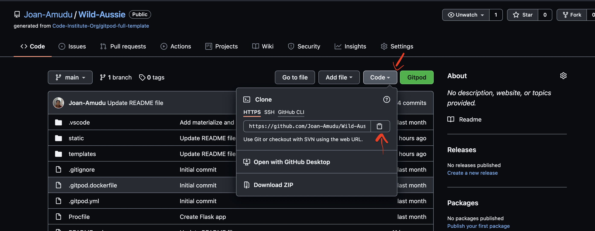

deployed site [here](https://wild-aussie.herokuapp.com/)

## About  

This is a site where I can post places that I am going to so that friends can see and join. so if I am going hiking in the loo mountains, I can post this on the site severals days in advance to tell people/friends what I intend on during, like hiking the giant start way on Saturday. I will also give details of how I will go to the said location. I can also post pics before (maybe from the internet or from previous similar activity) and after(pictures taken on the actual day). I can also share tips of what to wear, how tough or easy the hike was, weather and also other interesting things like where to what other walks/hikes or fun things to do in that area. Other people can also comment and share their experiences and also tips/recommendations for other fun places to go to and activities to do (so a blog site for others who share their own experiences within Australia)


## **Table of content** 

- [User Experience (UX)](#user-experience--ux-)
    - [Strategy](#strategy)
      - [User stories](#user-stories)
    - [Scope](#scope)
    - [Structure](#structure)
    - [Skeleton](#skeleton)
    - [Design](#design)
  - [Features](#features)
    - [Existing features](#existing-features)
    - [Future Development Features](#future-development-features)
    - [Failed Features](#failed-features)
  - [Technologies Used](#technologies-used)
    - [Languages](#languages)    
    - [Libraries, Frameworks and Templates](#libraries-frameworks-and-templates)
    - [Other technologies](#other-technologies)
    - [Database Used](#database-used) 
  - [Testing](#testing)

- [Deployment](#deployment)
  - [Deploying to Heroku](#deploying-to-heroku)
  - [Forking](#forking)
  - [Making a Local Clone](#making-a-local-clone)

   - [Credits](#credits)
     - [Code](#code)
     - [Content](#content)
     - [Media](#media)
     - [Acknowledgment](#acknowledgments)

*** 

## User Experience (UX)
## Strategy
This is a site where I can post places that I am going to so that friends can see and join. so if I am going hiking in the loo mountains, I can post this on the site severals days in advance to tell people/friends what I intend on during, like hiking the giant start way on Saturday. I will also give details of how I will go to the said location. I can also post pics before (maybe from the internet or from previous similar activity) and after(pictures taken on the actual day). I can also share tips of what to wear, how tough or easy the hike was, weather and also other interesting things like where to what other walks/hikes or fun things to do in that area. Other people can also comment and share their experiences and also tips/recommendations for other fun places to go to and activities to do (so a blog site for others who share their own experiences within Australia)


My inspiration of writing the client and user stories is driven from [mountain goat](https://www.mountaingoatsoftware.com/agile/user-stories).

### User Stories 

### Client Stories 
* As a site administrator, I can read site memebers published information and approve or reject them so that only valid and appropriate content is published.
* As a site administrator, I can delete any published information, so I can remove things that will no longer valid.
* As a site administrator, I can edit any site member profile so that I can correct problems for members. 

### User Stories 

#### New User
* As a site visitor, I can to find out what the site is about, so I can see if the site is for me without registering 
* As a site visitor, I would like to be able to register quickly, so I can add my own blog posts 
* As a site visitor, I can email news items to the editor, so they can be considered for publication. 
* As a site visitor, I want to read a new article on the front page about once a week so that I’m up on all the latest happenings.
* As a site visitor, I want the link from the article teaser to take me directly to the body of the article, not to another teaser setup, so that I can easily finish the article.
*  As a site visitor, I want to be able to get back to the home page quickly and easily, so I don’t get lost navigating and so the site works like every other site in the world. 
* As a site visitor, I can sign up for a newsletter so that I get announcements about new courses and other
information.

#### Existing User
* As a site member, I can sign in and out easily.
* As a site member, I can add/edit/delete images and change my profile image
* As a site member, I can delete my account easily.
* As a site member, I can add/edit/delete comments to my own and other profiles.
* As a site member, I can reset my password easily.
* As a site member, I want to have full access to all articles so there is a benefit to being a member.

#### All Users 
* As a user, I would like to feel safe when using the site.
* As a user, I would like to be able to contact site owners.
* As a user, I can read an FAQ so that all my questions are answered.
* As a search engine, I can view a site map so that all pages are indexed.
* As a user, I can read a privacy policy so that I know what’s private.

#### [Back to top](<#table-of-content>)

## User stories out of scope / failed to implement
### Client Stories 
Because there is nos super user account, the following client stories were not implemented.
* As a site administrator, I can read site members published information and approve or reject them so that only valid and appropriate content is published.
* As a site administrator, I can delete any published information, so I can remove things that will no longer valid.
* As a site administrator, I can edit any site member profile so that I can correct problems for members. 

#### New User
The following user stories were not implemented because the goals and direction of the project changed or they were out of scope of what is required for the project.
* As a site visitor, I want to read a new article on the front page about once a week so that I’m up on all the latest happenings.
* As a site visitor, I want the link from the article teaser to take me directly to the body of the article, not to another teaser setup, so that I can easily finish the article.
* As a site visitor, I can sign up for a newsletter so that I get announcements about new courses and other information.

#### Existing User
The following user stories failed to implement due to a difficulty in rendering code correctly.
* As a site member, I can add/edit/delete comments to my own and other profiles.
* As a site member, I can reset my password easily.


#### All Users 
The following user stories were out of scope for the project, however can be implemented at a later stage.
* As a user, I can read an FAQ so that all my questions are answered.
* As a search engine, I can view a site map so that all pages are indexed.
* As a user, I can read a privacy policy so that I know what’s private.


#### [Back to top](<#table-of-content>)
***
## Scope

User expectations
* create Trek
* Edit Trek
* Delete Trek
* Comment on other Treks
* View other treks
* Edit profile
* Delete profile


#### [Back to top](<#table-of-content>)
***
## Structure
#### Database
* Mongogdb, a NOSQL database was used used to store data using key value pairs.
* The ERD below shows the 3 collections and the relations between them

* The ERD was designed *using [dbdiagram.io](https://dbdiagram.io/home)

  - Inital entity realtionship diagram


* Click here for the [Initial ERD](static/images/database/erd.png)

#### [Back to top](<#table-of-content>)
***
## Skeleton
### Wireframes
* Wireframes were created using the [Balsamiq](https://balsamiq.com/wireframes/) software.



* All Wireframes
  - [blog](static/images/wireframes/blog.png)
  - [login](static/images/wireframes/login.png)
  - [register](static/images/wireframes/register.png)
  - [contact-us](static/images/wireframes/contact-us.png)
  - [create-post](static/images/wireframes/create-post.png)
  - [edit-post](static/images/wireframes/edit-post.png)
  - [my-page](static/images/wireframes/my-page.png)
  - [show-post](static/images/wireframes/show-pots.png)

* A pdf of the wireframes can be found [here](static/doc/wild-aussie-wireframes.pdf), by clicking on the download button in Github. (**Please Note:** _[Adobe Acrobat Reader](https://get.adobe.com/reader/) is required to view files in pdf format_).

#### [Back to top](<#table-of-content>)
***
## Design
The webiste's design and layout is based on fonts, colors, wireframes, images and icons.

### Fonts
* Google Fonts was imported to CSS with the **Dancing Script** for the brand name, **Zilla Slab** for the body and **sans-serif** as the fallback font.

### Color Scheme
* The color palatte was inspired by the costal colors in Australia


#### [Back to top](<#table-of-content>)
***
## Features
### Existing Features
Below are some of the existing features
* Responsive Navbar
* Social Media links
* Registration page
* Contcat us page
* Log in page
* user profile page
* Search functionality


### Future Development Features
Below are some features to be implemented at a later stage
* Profile picture
* Edit and Delete profile functionalities
* Comments
* location specific maps
* password reset functionality
* A bot/chat function to help with basic issues like passowrd reset

### Failed Features
 #### Comments

 Initially there was to be a comments functionality, where users can comment on other treks from the show_post.html. users could also be able to edit and delete their comments.

 I had a comments collection in the database, however after so many trials and failures, including support from fellow students, I was not able to get the results I expected.

**python code** -  Below is the basic py code from which I developed so many variations and still failed to implement the comments for this project and will be done at a later stage.

      @app.route("/add_comment", methods=["GET", "POST"])
        def add_comment():
            if request.method == "POST":
                comnt = {
                    "first_name": request.form.get("first_name"),
                    "comment": request.form.get("comment")
                }
                mongo.db.comments.insert_one(comnt)
                flash("comment added successfully")

            comment = mongo.db.comments.find()
            return render_template("add_comment.html", comment=comment)

* The commets section was taken out and  replaced with edit and delete functionalities on the show_post.html
#### [Back to top](<#table-of-content>)
***
## Technologies Used
### Languages
* HTML5
* CSS3
* JavaScript
* Python
### Libraries, Frameworks and Templates
* [jquery](https://jquery.com/)
* [flask](https://flask.palletsprojects.com/)
* [jinja templates](https://jinja.palletsprojects.com/)
* [Materialize CSS](https://materializecss.com/)

### Other Technologies
* [Google maps](https://maps.google.com/)
* [Font Awesome](https://fontawesome.com/)

### Database Used
* [MongoDB](https://www.mongodb.com/)

#### [Back to top](<#table-of-content>)
***
## Testing
Click here for [Testing Document](testing.md)
#### [Back to top](<#table-of-content>)
***

## Deployment

**Deploying to [Heroku](https://dashboard.heroku.com/)**

* You will need an account to sign up to [Heroku](https://www.heroku.com)
* Once logged in click the create new app button
* Select the region closest to you and give the APP a name
* Set your deployment method to 'GitHub'
 
* Connect to GitHub and login
* Search for the repository you wish to deploy from
* You will need to head to settings and click 'Config Vars' to set the enviromnents.
    * You will now need to set up your Configuration Vars the same way as you did for your env.py

    - **Set environment in Heroku App** 
      - Go to settings, then click on reveal config vars
      - Enter your key value pairs as per your env.py file (without the inverted commas)
    
* Make sure you have set up your Procfile and you have updated the requirements.txt prior to deploying    
 - Enable automatic deploys 
      
* Once it is deployed you will be able to view the app


### Forking

Forking the GitHub Repository

By forking the GitHub Repository, you can make a copy of the original repository in your own GitHub account.  This means we can view or make changes without making the changes affecting the original.

      You can make a copy of the GitHub Repository by "forking" the original repository onto your own account, where changes can be made without affecting the original repository by taking the following steps: 

   
1. Login to your account on [Github](https://github.com/).
2. Locate the [Repository](https://github.com/Joan-Amudu/Wild-Aussie) used for this project.
3. On the right-hand side of the Repository name, you'll see the 'Fork' button.

4. This will create a copy in your personal repository.
5. Once you're finished making changes, return to original repository and press 'New Pull Request' to request your changes to be merged into the original project.

### Making a Local Clone

1. Log in to [GitHub]() and 
2. Locate the [GitHub Repository](https://github.com/Joan-Amudu/Wild-Aussie).
3. Under the repository name, click Code.
4. To clone the repository, select HTTPS and copy the link.

5. Open Git Bash.
6. Change the current working directory to the location where you want the cloned directory to be made.
7. Type **git clone**, and then paste the URL you copied in Step 3.

```
 git clone https://github.com/YOUR-USERNAME/YOUR-REPOSITORY
```
    * To clone this particular repository:
    git clone https://github.com/Joan-Amudu/Wild-Aussie

7. Press Enter. Your local clone will be created.
8. Change into the directory being created.

Click [Here](https://help.github.com/en/github/creating-cloning-and-archiving-repositories/cloning-a-repository) for more information about cloning repositories. 


#### [Back to top](<#table-of-content>)
***
## Credits
### Images

#### [Unsplash](https://unsplash.com/) 
* [Danny Lau](https://unsplash.com/@kirk7501)
* [Photoholgic](https://unsplash.com/@photoholgic)
* [Shaukat ali](https://unsplash.com/@ozasiatraveller)
* [Gilly Tanabose](https://unsplash.com/@glt23)

#### [National Parks NSW](https://www.nationalparks.nsw.gov.au):
* [Natasha Funke/OEH](https://www.nationalparks.nsw.gov.au/-/media/npws/images/parks/ku-ring-gai-chase-national-park/west-head-army-track/west-head-army-track-01.jpg )
* [Robert Mulally/DPIE](https://www.nationalparks.nsw.gov.au/visit-a-park/parks/thredbo-perisher-area )

All Trek descriptions are from [National Parks NSW] https://www.nationalparks.nsw.gov.au/

### General Inspiration
Through out this project, I was inspired by the following repositories from fellow Code Institue Students:

[Amy O'Shea](https://github.com/AmyOShea/MS3-Cocktail-Hour)
[Claire](https://github.com/Code-Institute-Submissions/Codzilla)
[Rebecca Kelsall](https://github.com/crypticCaroline/puppyplaymates)

#### [Back to top](<#table-of-content>)
***
## Acknowledgements
