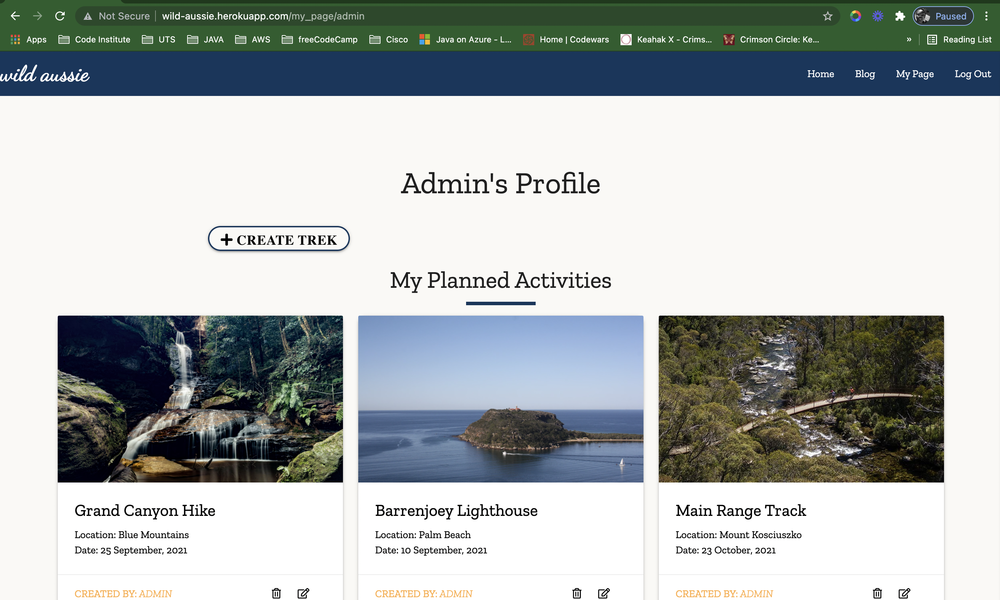
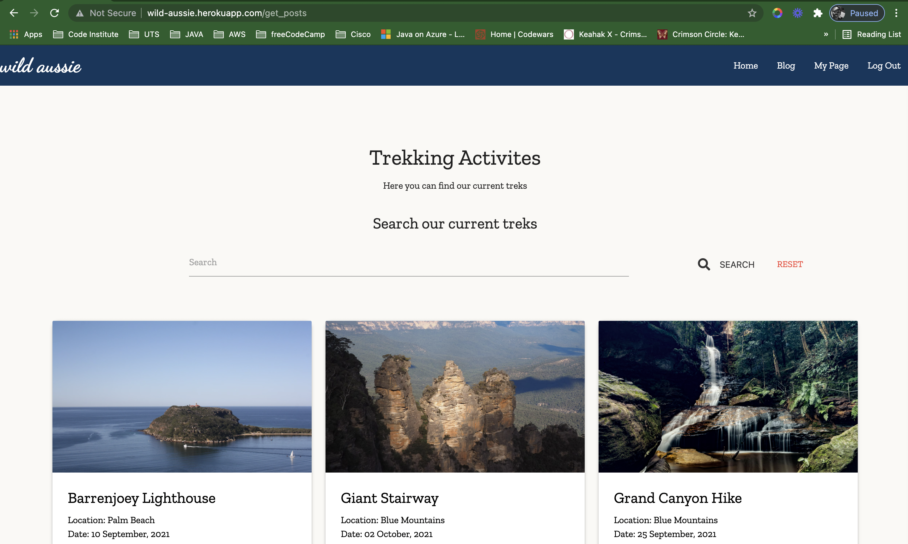
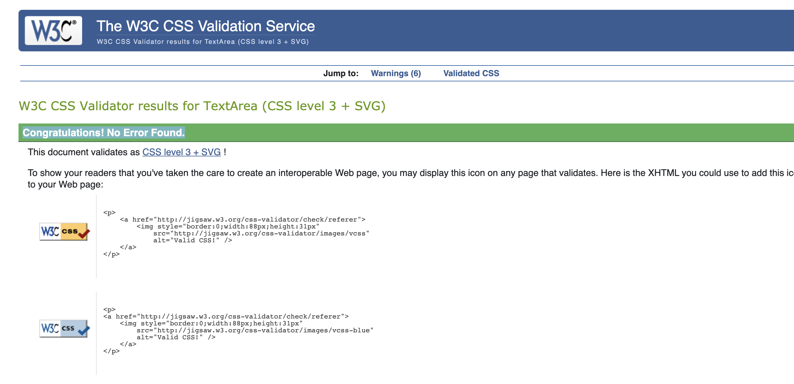
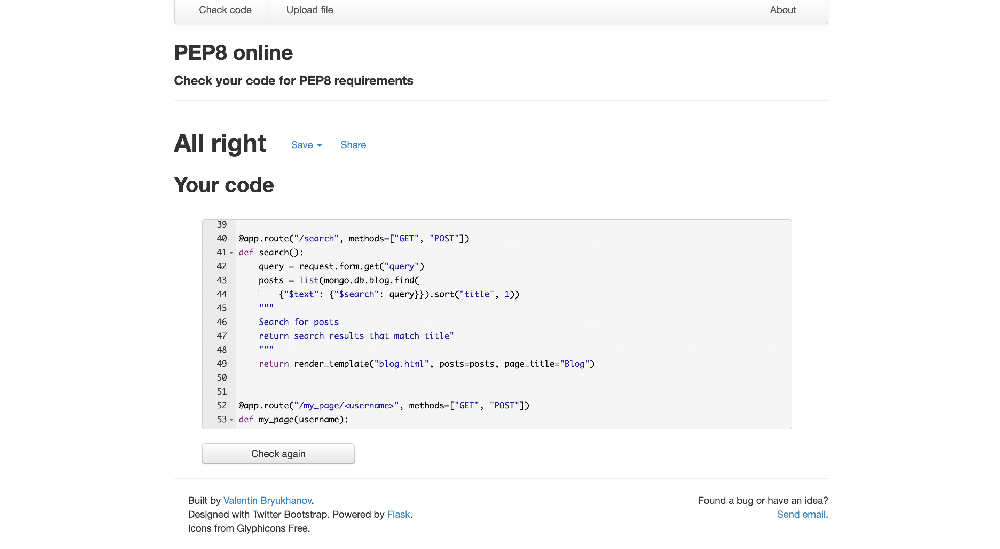

# TESTING

## Table of Contents
- [Testing User Stories](#testing-user-stories)
- [Functional Testing](#functional-testing)
- [Browser Compatibility](#browser-compatibility)
- [Responsiveness](#responsiveness)
- [Validators](#validators)

*** 

## Testing User Stories

* As a site visitor, I can find out what the site is about, so I can see if the site is for me without registering.
    -  From the home page, its clear what site is about, from the simple welcome test, hero image and featured section
 
* As a site visitor, I would like to be able to register quickly, so I can add my own blog posts 
    - Registration is done easily through the registration page.
    - After registering, users have access to their My_Page where they can create Treks
        
* As a site visitor, I can email news items to the editor, so they can be considered for publication. 
    - This can be done through the contact us page

*  As a site visitor, I want to be able to get back to the home page quickly and easily, so I don’t get lost navigating and so the site works like every other site in the world. 
    - The Nav bar is accessible on all pages and clicking Home menu item or the wild aussie brand name leads the user back to the home page

* As a site member, I can sign in and out easily.
    - This is achieved through Login and logout functioninality.
* As a site member, I want to have full access to all articles so there is a benefit to being a member.
    -  The blog contains all Treks
    
    

#### [Back to top](<#table-of-content>)
***
## Functional Testing
Test Case | Action | Expected Result | Pass/Fail | Comments 
---------------|---------------|---------------|---------------|---------------
TC001 |Clicking Brand Name| Clicking the "wild aussie" brand name from any view should direct the user to the Home Page. | Pass
TC002 |Clicking Home Menu Item| Clicking the "Home Menu Item" from any view should direct the user to the Home Page. | Pass
TC003 |Clicking Home Menu Item| Clicking the "Home Menu Item" should display the page title at the top of the site window/tab along side with the brand name and logo. | Pass 
TC004 |Clicking Join Us Button| Clicking the "Join Us " Button on the hero image, should direct the user to the Register form.| Pass 
TC005 |Hovering over github icon on the Footer | The icon color should change to white and the github http link should be simultaneouly displayed from the bottom right of the page| Pass
TC006 |Clicking the github icon on the Footer | The link should open in a new tab| Pass | Users do not need a github account to view the repository, but it is recommended to have one for other functionalities such as forking and cloning the repository.
TC007 |Hovering over facebook icon on the Footer| The icon color should change to white and the facebook HTTP link should be displayed from the bottom right of the page| Pass
TC008 |Clicking facebook icon on the Footer| The link should open in a new tab| Pass | Users must have a facebook account in order to login, or register for one. 
TC009 |Hovering over twitter icon on the Footer | The icon color should change to white and the twitter HTTP link should be displayed from the bottom right of the page| Pass
TC0010 |Clicking twitter icon on the Footer| The link should open in a new tab| Pass | Users much have a twitter account, or register for one.
TC0011 |Hovering over instagram icon on the Footer| The icon color should change to white and the instagram HTTP link should be displayed from the bottom right of the page| Pass
TC0012 |Clicking instagram icon on the Footer| The link should open in a new tab| Pass | Users must have an instagram account in order to login, or register for one.
TC0013 |Clicking any featured Trek | If user is not logged in, clicking featured treks should direct the user to login page| Pass | Only Logged in Users can view more details about treks, clicking featured tresk will direct logged in user to show-post page.
TC0014 |Limited Menu Items for Non logged in users| Users who are not logged in or do not have a profile will only view limited menu items ie. Home, Log In, Register and Contact Us | Pass
TC0015 |Clicking Login Menu Item| This action should display the page title at the top of the site window/tab along side with the brand name and logo | Pass
TC0016 |Clicking Login Menu Item| This action should display the page which includes a form for users to login | Pass
TC0017 |Clicking Register Here Link| On the Log in for, register here link is for users who do not have an account and this should direct the user to register form | Pass
TC0018 |Clicking Register Menu Item| This action should display the page title at the top of the site window/tab along side with the brand name and logo | Pass
TC0019 |Clicking Register Menu Item| This action should display the registration form| Pass
TC0020 |Clicking Login link on Register Form| From the register form, clicking the Login link, should redirect the user to the Log In form| Pass
TC0021 |Clicking Register Menu Item| This action should display the page title at the top of the site window/tab along side with the brand name and logo | Pass
TC0022 |Registration From - username must have more than 5 characters| four or less character will render the input field red meaning more characters are needed| Pass
TC0023 |Registration From - email must be valid| email input field will only take valid email format otherwise the form will return "wrong" beneath the input field | Pass
TC0024 |Login Form - username | An invalid username will return a flash message informing the user that either username or password is invalid | Pass
TC0025 |Login Form - password | A wrong password will return a flash message informing the user that either username or password is invalid | Pass
TC0026 |Login Form - Successful | Successful login will direct the user to their user page | Pass
TC0027 |Nav bar Menu Items | Logged in users have views of Home, Blog, My_page and Home, and Contact Us menu items| Pass
TC0028 |My-Page - Loging in to user page | This action should display the page title at the top of the site window/tab along side with the brand name and logo | Pass
TC0029 |My-Page - Loging in to user page | Flash message welcoming user is displayed at top of page | Pass
TC0030 |My-Page - Loging in to user page | Flash message should disapear after 30 seconds | Pass
TC0031 |My-Page - Create Trek | This should redirect the user to Create Trek form | Pass
TC0032 |My-Page - Create Trek | This action should display the page title at the top of the site window/tab along side with the brand name and logo | Pass

TC0033 |Create Trek Form - Cancel | This should cancel the form and redirect the user back to their profile page | Pass
TC0034 |Create Trek Form - Add | After adding all input information this should add a Trek card on user profile | Pass | Users must select a grade from the dropdown menu before they can add an Trek
TC0035 |Treks - Clicking Delete Icon | Users should be prompted with a modal confirming the delete action| Pass
TC0036 |Treks - Clicking Delete Icon - Yes | Selecting "Yes" will delete the Trek| Pass
TC0037 |Treks - Clicking Delete Icon - No | Selecting "No" will return users back to user profile page view| Pass
TC0038 |Trek Card - Clicking Card | Clicking anywhere on the card will redirect the user to the "show_post page| Pass | Valid only for logged in users
TC0039 |Trek Crad - Edit Icon | This action should display the page title at the top of the site window/tab along side with the brand name and logo | Pass
TC0040 |Trek Card - Edit icon - Save | This action should update the Trek, save to the database and return user to user profile page| Pass
TC0041 |Trek card - Edit icon - Cancel | This action should cancel the form and return user to user profile page| Pass
TC0042 |Show Post - Edit icon | Edit functionality should only be visible to the users who created the Trek| Pass | see TC0039 - 41
TC0043 |Show Post - Edit icon | This should redirect users to edit post prefilled form| Pass
TC0044 |Show Post - Edit icon - Save | TC0040 | Pass 
TC0045 |Show Post - Edit icon - Cancel | TC0041| Pass
TC0046 |Show Post - Delete icon |Delete functionality should only be visible to the users who created the Trek| Pass | Defensive programming applied - see TCOO35 - 37
TC0047 |Blog | This action should display the page title at the top of the site window/tab along side with the brand name and logo| Pass
TC0048 |Blog - Search Functionality | This action will return result based on search word anywhere the searched word appears on the created trek | Pass
TC0049 |Blog| Displays all created Treks | Pass
TC0050 | Clicking Log out| Clicking log out from the menu Item, logs the user out of session | Pass 

#### [Back to top](<#table-of-content>)
***

### Browser Compatibility
This project was tested successfully on the following browsers
* Google Chrome
* Microsoft Edge
* Firefox
* Safari

#### [Back to top](<#table-of-content>)
***

### Responsiveness
This project was built using [Materialize](https://materializecss.com/), and mobile first design and all pages are responsive on small, medium, large and extra-large screens

#### [Back to top](<#table-of-content>)
***

### Validators
This project was built using [Materialize](https://materializecss.com/), and mobile first design and all pages are responsive on small, medium, large and extra-large screens

**CSS Code** was passed through the **[W3C CSS Validator](https://jigsaw.w3.org/css-validator/ "W3C CSS Validator")**.

**Python Code** was passed through **[PEP8 Online](http://pep8online.com/)

#### [Back to top](<#table-of-content>)
***